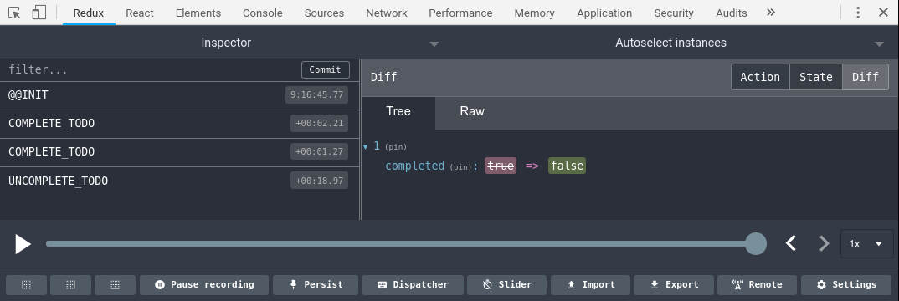

# Use DevTools Hooks

Use React hooks with Redux DevTools Extension.



> Hooks are an **up coming** feature of React.
> For more information see [Introducing Hooks](https://reactjs.org/docs/hooks-intro.html).

## Installation

`npm install use-devtools-hook`  
or  
`yarn add use-devtools-hook`

## Usage

[Redux DevTools Extension](https://github.com/zalmoxisus/redux-devtools-extension) must be installed and `window.__USE_DEVTOOLS__ = true` must be in your app. Preferable at the root.

## useReducerDevtools

useReducerDevtools is for using devtools with the useReducer hook.  
It takes the result from useReducer, an initial state and an instance name as arguments.

## useStateDevtools

useStateDevtools is for using devtools with the useState hook.
useStateDevtools takes the result from useState, an initial state and an instance name as arguments.

```
const stateReducer = useReducer(reducer, initialState)
const countState = useState(initialState)

const [state, dispatch] = useReducerDevtools(
  stateReducer,
  initialState,
  'TODO'
)
const [count, setCount] = useStateDevtools(countState, initialState, 'COUNT')
```

## Example

```
import React, { useState } from 'react'
import ReactDOM from 'react-dom'
import { useStateDevtools } from './use-devtools'

window.__USE_DEVTOOLS__ = true

export default function App() {
  const initialState = 0
  const countState = useState(initialState)
  const [count, setCount] = useStateDevtools(countState, initialState, 'COUNT')

  function handleDecrement(e) {
    e.preventDefault()
    setCount(count - 1)
  }

  function handleIncrement(e) {
    e.preventDefault()
    setCount(count + 1)
  }

  return (
    <div>
      <div>
        Count is {count} <button onClick={handleDecrement}> - </button>
        <button onClick={handleIncrement}>+</button>
      </div>
    </div>
  )
}

const rootElement = document.getElementById('root')
ReactDOM.render(<App />, rootElement)

```

For a full example with useReducer see [Todos example](src/examples/Todos.js)

## License

MIT
